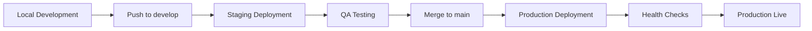

# 🚀 ShelfQuest Deployment Guide

Complete deployment documentation for production, staging, and development environments.

## 📋 **Deployment Overview**

ShelfQuest uses a **modern multi-service architecture** with automated CI/CD pipelines for reliable deployments across environments.

### **Architecture Overview**
```
┌─────────────────┐    ┌─────────────────┐    ┌─────────────────┐
│   Frontend      │    │   Backend       │    │   AI Service    │
│   (Vercel)      │────│   (Render)      │────│   (Render)      │
│   React + Vite  │    │   Express.js    │    │   FastAPI       │
└─────────────────┘    └─────────────────┘    └─────────────────┘
         │                       │                       │
         └───────────────────────┼───────────────────────┘
                                 │
                    ┌─────────────────┐
                    │   Database      │
                    │   (Supabase)    │
                    │   PostgreSQL    │
                    └─────────────────┘
```

### **Deployment Targets**
| Environment | Frontend | Backend | AI Service | Database |
|-------------|----------|---------|------------|----------|
| **Development** | localhost:3000 | localhost:5000 | localhost:8000 | Local Supabase |
| **Staging** | Vercel Preview | Render Service | Render Service | Staging DB |
| **Production** | Vercel | Render Service | Render Service | Production DB |

## 🎯 **Environment Strategy**

### **Environment Separation**
- **Development**: Full local development with hot reloading
- **Staging**: Production-like environment for testing
- **Production**: Live production environment with optimizations

### **Configuration Management**
All environments use **environment variables** for configuration (no hardcoded values):

```bash
# Environment-specific builds
pnpm run build:development    # localhost URLs
pnpm run build:staging        # staging URLs
pnpm run build:production     # production URLs
```

## 🔧 **CI/CD Pipeline**

### **Automated Workflows**
Your CI/CD system includes **5 comprehensive workflows**:

| Workflow | Triggers | Purpose |
|----------|----------|---------|
| **ci-cd-integrated.yml** | Push to main/develop | Full deployment pipeline |
| **security-scan-enhanced.yml** | Push, PR, daily | Security scanning |
| **ci.yml** | Push, PR | Quality gates |
| **cd-production.yml** | Manual/main branch | Production deployment |
| **test-secrets.yml** | Manual | Secret validation |

### **Quality Gates**
Before any deployment:
- ✅ **Unit tests** (client + server + AI service)
- ✅ **Linting** and code quality checks
- ✅ **Security audits** (npm audit + advanced scanning)
- ✅ **Build validation** for target environment
- ✅ **Environment-specific configuration** validation

### **Deployment Flow**
```
Code Push → Quality Gates → Build → Deploy → Health Check → Notify
```

## 🌐 **Frontend Deployment (Vercel)**

### **Vercel Configuration**
Your `vercel.json` is configured for optimal performance:

```json
{
  "version": 2,
  "builds": [
    {
      "src": "client2/package.json",
      "use": "@vercel/static-build",
      "config": {
        "buildCommand": "pnpm install && pnpm run build:production",
        "installCommand": "pnpm install",
        "rootDirectory": "client2"
      }
    }
  ],
  "routes": [
    {
      "src": "/(.*)",
      "dest": "/client2/$1"
    }
  ],
  "env": {
    "VITE_API_BASE_URL": "https://library-server-m6gr.onrender.com",
    "VITE_AI_SERVICE_URL": "https://shelfquest-ai-production.onrender.com"
  }
}
```

### **Manual Vercel Deployment**

#### **1. Initial Setup**
```bash
# Install Vercel CLI
npm install -g vercel

# Login to Vercel
vercel login

# Link project
cd client2
vercel link
```

#### **2. Environment Variables**
Set in Vercel Dashboard (Settings → Environment Variables):

**Production:**
```bash
VITE_API_BASE_URL=https://library-server-m6gr.onrender.com
VITE_AI_SERVICE_URL=https://shelfquest-ai-production.onrender.com
VITE_SUPABASE_URL=https://your-prod-project.supabase.co
VITE_SUPABASE_ANON_KEY=your-prod-supabase-anon-key
VITE_ENABLE_SERVICE_WORKER=true
VITE_APP_ENV=production
```

**Preview (Staging):**
```bash
VITE_API_BASE_URL=https://shelfquest-server-staging.onrender.com
VITE_AI_SERVICE_URL=https://shelfquest-ai-staging.onrender.com
VITE_SUPABASE_URL=https://your-staging-project.supabase.co
VITE_SUPABASE_ANON_KEY=your-staging-supabase-anon-key
VITE_ENABLE_SERVICE_WORKER=true
VITE_APP_ENV=staging
```

#### **3. Deploy Commands**
```bash
# Deploy to production
vercel --prod

# Deploy to preview (staging)
vercel

# Deploy with specific environment
vercel --env VITE_APP_ENV=production
```

### **Automated Vercel Deployment**
Your CI/CD automatically deploys:
- **develop branch** → Vercel Preview (staging)
- **main branch** → Vercel Production

## 🔧 **Backend Deployment (Render)**

### **Render Configuration**

#### **1. Service Setup**
Create a new **Web Service** on Render:
- **Repository**: Connect your GitHub repository
- **Root Directory**: `server2`
- **Build Command**: `pnpm install`
- **Start Command**: `pnpm start`
- **Environment**: Node

#### **2. Environment Variables**
Set in Render Dashboard (Environment):

```bash
# Server Configuration
PORT=5000
NODE_ENV=production

# Supabase Configuration
SUPABASE_URL=https://your-project.supabase.co
SUPABASE_SERVICE_KEY=your-supabase-service-key

# JWT Security
JWT_SECRET=your-super-secure-jwt-secret-256-bits
JWT_REFRESH_SECRET=your-super-secure-refresh-secret-256-bits

# Production Security
COOKIE_DOMAIN=yourdomain.com
FINGERPRINT_SALT=random-salt-for-fingerprinting
ENABLE_SECURITY_LOGGING=true

# AI Service Integration
AI_SERVICE_URL=https://shelfquest-ai-production.onrender.com
AI_SERVICE_TIMEOUT=30000

# File Upload Configuration
MAX_FILE_SIZE=52428800
ALLOWED_FILE_TYPES=pdf,epub
UPLOAD_RATE_LIMIT=20
```

#### **3. Health Checks**
Render will automatically monitor:
- **Health Check Path**: `/health`
- **Expected Response**: 200 status code
- **Timeout**: 30 seconds

#### **4. Auto-Deploy**
Configure auto-deploy from:
- **Production**: `main` branch
- **Staging**: `develop` branch (separate service)

### **Manual Backend Deployment**

#### **Using Git (Automatic)**
```bash
# Deploy to production
git push origin main

# Deploy to staging
git push origin develop
```

#### **Direct Render Deploy**
```bash
# Connect Render CLI (optional)
pip install render-cli

# Deploy manually
render deploy --service-id your-service-id
```

## 🤖 **AI Service Deployment (Render)**

### **Render Configuration**

#### **1. Service Setup**
Create a new **Web Service** on Render:
- **Repository**: Your GitHub repository
- **Root Directory**: `ai-service`
- **Build Command**: `pip install -r requirements.txt`
- **Start Command**: `uvicorn main:app --host 0.0.0.0 --port $PORT`
- **Environment**: Python 3

#### **2. Environment Variables**
```bash
# Google AI Configuration
GOOGLE_API_KEY=your-gemini-api-key

# Service Configuration
PORT=8000
ENVIRONMENT=production

# API Configuration
MAX_REQUEST_SIZE=10485760
REQUEST_TIMEOUT=30
CORS_ORIGINS=https://your-frontend-domain.vercel.app

# Logging
LOG_LEVEL=INFO
ENABLE_DEBUG=false
```

#### **3. Health Checks**
- **Health Check Path**: `/health`
- **API Documentation**: `/docs` (Swagger UI)

### **AI Service Requirements**
```txt
fastapi>=0.104.0
uvicorn[standard]>=0.24.0
google-generativeai>=0.3.0
python-dotenv>=1.0.0
pydantic>=2.0.0
```

## 💾 **Database Deployment (Supabase)**

### **Production Database Setup**

#### **1. Create Production Project**
1. Go to [Supabase Dashboard](https://app.supabase.com/)
2. Create new project
3. Choose **Production** tier for better performance
4. Select region closest to your users
5. Set strong database password

#### **2. Database Configuration**
```sql
-- Run in Supabase SQL Editor

-- Enable necessary extensions
CREATE EXTENSION IF NOT EXISTS "uuid-ossp";
CREATE EXTENSION IF NOT EXISTS "pg_trgm";

-- Run your database schema (see ENVIRONMENT_SETUP.md)
-- Create all tables, indexes, and RLS policies
```

#### **3. Connection Pooling**
For production, enable **connection pooling**:
- Go to Settings → Database
- Enable **Connection pooling**
- Use pooled connection string in production

#### **4. Backups**
Supabase automatically backs up production databases:
- **Point-in-time recovery**: Available for Pro plans
- **Daily backups**: Retained based on plan
- **Manual backups**: Export via Dashboard

### **Database Migration Strategy**
```bash
# Run migrations on production
cd server2
pnpm run migrate

# Backup before major changes
# Use Supabase Dashboard -> Settings -> Database -> Backups
```

## 📱 **Android Deployment (Google Play Store)**

### **Build Configuration**

#### **1. Release Build**
```bash
cd android

# Generate release keystore (one-time setup)
./generate-keystore.sh

# Build release APK
./gradlew assembleRelease

# Build App Bundle (recommended for Play Store)
./gradlew bundleRelease
```

#### **2. Keystore Management**
```bash
# Keystore location (keep secure)
android/app/release.keystore

# Configure gradle.properties
MYAPP_RELEASE_STORE_FILE=release.keystore
MYAPP_RELEASE_KEY_ALIAS=your-key-alias
MYAPP_RELEASE_STORE_PASSWORD=your-store-password
MYAPP_RELEASE_KEY_PASSWORD=your-key-password
```

### **Play Store Deployment**
1. **Create Play Console account**
2. **Upload app bundle** (.aab file)
3. **Configure store listing**
4. **Submit for review**

Detailed instructions in `android/play-store-listing.md`.

## 🔐 **Secret Management**

### **GitHub Repository Secrets**
Configure in GitHub Settings → Secrets and variables → Actions:

```bash
# Vercel Deployment
VERCEL_TOKEN=your-vercel-access-token
VERCEL_ORG_ID=team_xxxxxxxxxxxx
VERCEL_PROJECT_ID=prj_xxxxxxxxxxxx

# Production Environment
PRODUCTION_SUPABASE_URL=https://your-prod-project.supabase.co
PRODUCTION_SUPABASE_ANON_KEY=eyJhbGciOiJIUzI1NiIsInR5cCI6IkpXVCJ9...

# Staging Environment (Optional)
STAGING_SUPABASE_URL=https://your-staging-project.supabase.co
STAGING_SUPABASE_ANON_KEY=eyJhbGciOiJIUzI1NiIsInR5cCI6IkpXVCJ9...
```

### **Secret Validation**
Test your secrets with:
```bash
# Run secret validation workflow
gh workflow run test-secrets.yml
```

## 🚨 **Monitoring & Health Checks**

### **Health Check Endpoints**

#### **Frontend Health Check**
```bash
curl https://your-frontend.vercel.app/
# Should return: 200 OK with app loaded
```

#### **Backend Health Check**
```bash
curl https://your-backend.onrender.com/health
# Returns: {"status":"healthy","timestamp":"2024-01-01T00:00:00.000Z"}
```

#### **AI Service Health Check**
```bash
curl https://your-ai-service.onrender.com/health
# Returns: {"status":"healthy","version":"1.0.0"}
```

### **Monitoring Tools**

#### **Built-in Monitoring**
- **Vercel**: Analytics and Web Vitals
- **Render**: Metrics and logs
- **Supabase**: Database performance and queries

#### **Error Tracking**
Consider adding:
- **Sentry**: For error tracking and performance monitoring
- **LogRocket**: For session replay and debugging

### **Performance Monitoring**
```bash
# Check Core Web Vitals
curl -s "https://pagespeed.web.dev/api/pagespeedapi/v5/runPagespeed?url=YOUR_FRONTEND_URL&category=performance"

# Monitor API response times
curl -w "@curl-format.txt" -o /dev/null -s "YOUR_API_URL/health"
```

## 🔄 **Deployment Workflows**

### **Development to Production Flow**



### **Hotfix Flow**
```bash
# Emergency hotfix process
git checkout main
git checkout -b hotfix/critical-fix
# Make fix
git commit -m "hotfix: critical issue"
git push origin hotfix/critical-fix
# Create PR to main (fast-track review)
# Deploy immediately after merge
```

### **Rollback Strategy**
```bash
# Frontend rollback (Vercel)
vercel rollback

# Backend rollback (Render)
# Use Render dashboard to redeploy previous successful build

# Database rollback (Supabase)
# Use point-in-time recovery (Pro plans)
# Or restore from manual backup
```

## ⚡ **Performance Optimization**

### **Frontend Optimizations**
- ✅ **Bundle splitting** with Vite
- ✅ **Service Worker** for offline capability
- ✅ **Image optimization** with `sharp`
- ✅ **Resource preloading** for critical assets
- ✅ **Compression** with gzip/brotli

### **Backend Optimizations**
- ✅ **Connection pooling** with Supabase
- ✅ **Rate limiting** to prevent abuse
- ✅ **Caching** with advanced caching layer
- ✅ **Query optimization** with custom optimizer
- ✅ **Compression** middleware

### **Database Optimizations**
- ✅ **Indexes** on frequently queried columns
- ✅ **RLS policies** for security and performance
- ✅ **Connection pooling** for concurrent requests

## 📊 **Deployment Checklist**

### **Pre-Deployment**
- [ ] **All tests passing** (`pnpm run test:all`)
- [ ] **Security scan clean** (`pnpm audit`)
- [ ] **Environment variables** configured for target environment
- [ ] **Database migrations** applied
- [ ] **Secrets validated** (GitHub secrets test workflow)
- [ ] **Build successful** for target environment

### **Post-Deployment**
- [ ] **Health checks** all green
- [ ] **Frontend loads** without errors
- [ ] **API endpoints** responding correctly
- [ ] **Database connections** working
- [ ] **Authentication flow** functional
- [ ] **File uploads** working
- [ ] **AI service** responding
- [ ] **Performance metrics** acceptable
- [ ] **Error monitoring** active

### **Production-Specific**
- [ ] **Domain configured** and SSL active
- [ ] **CDN** optimizations enabled
- [ ] **Monitoring** alerts configured
- [ ] **Backup** strategy verified
- [ ] **Documentation** updated
- [ ] **Team notified** of deployment

## 🚨 **Troubleshooting Deployments**

### **Common Issues**

#### **Build Failures**
```bash
# Check build logs
vercel logs    # For frontend
# Or check Render dashboard for backend/AI service

# Common fixes:
# 1. Environment variables missing
# 2. Node.js version mismatch
# 3. Dependencies not installed properly
```

#### **Environment Variable Issues**
```bash
# Verify environment variables are set
curl -X GET "https://your-api.onrender.com/debug/env"

# Check if values are correctly formatted (no quotes, special chars escaped)
```

#### **Database Connection Issues**
```bash
# Test database connection from server
curl -X GET "https://your-api.onrender.com/debug/db-connection"

# Check Supabase service status
# https://status.supabase.com/
```

#### **Service Communication Issues**
```bash
# Test API connectivity
curl -X GET "https://your-frontend.vercel.app/api/health"

# Test AI service integration
curl -X POST "https://your-api.onrender.com/ai/test"
```

### **Getting Help**
1. **Check service status pages**:
   - [Vercel Status](https://www.vercel-status.com/)
   - [Render Status](https://status.render.com/)
   - [Supabase Status](https://status.supabase.com/)

2. **Review logs**:
   - Vercel: Dashboard → Functions → Logs
   - Render: Dashboard → Service → Logs
   - GitHub Actions: Actions tab → Failed workflow

3. **Community support**:
   - [Vercel Discord](https://vercel.com/discord)
   - [Render Community](https://community.render.com/)
   - [Supabase Discord](https://discord.supabase.com/)

## 🎯 **Next Steps**

After successful deployment:

1. **Set up monitoring** and alerting
2. **Configure backup** schedules
3. **Plan scaling** strategy
4. **Implement** A/B testing (if needed)
5. **Set up** analytics
6. **Document** runbooks for common operations

Your ShelfQuest application is now ready for production deployment! 🚀

---

*For environment setup, see [ENVIRONMENT_SETUP.md](./ENVIRONMENT_SETUP.md)*
*For API documentation, see [API.md](./API.md)*
*For troubleshooting, see [TROUBLESHOOTING.md](./TROUBLESHOOTING.md)*