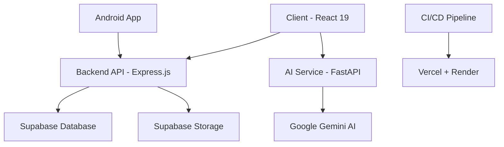

# 👋 Welcome to Literati Development Team!

Complete onboarding guide for new developers joining the Literati Digital Library project.

## 🎯 **What You're Building**

**Literati** is a modern, full-stack digital library application that helps users:
- 📚 **Manage** personal book collections
- 📖 **Track** reading progress and sessions
- 📝 **Take notes** with AI-powered summarization
- 🎮 **Gamify** reading experience with achievements and goals
- 📱 **Access** content across web and mobile platforms

## 🏗️ **Architecture Overview**



### **Technology Stack**
| Layer | Technology | Purpose |
|-------|------------|---------|
| **Frontend** | React 19 + Vite + Tailwind CSS | Progressive Web App |
| **Backend** | Express.js + Supabase | REST API & Database |
| **AI Service** | FastAPI + Google Gemini | Note summarization |
| **Mobile** | Android (Java/Kotlin) | Native mobile app |
| **Database** | PostgreSQL (Supabase) | Data persistence |
| **Storage** | Supabase Storage | File storage |
| **Deployment** | Vercel + Render | Production hosting |
| **CI/CD** | GitHub Actions | Automated deployment |

## 🚀 **Day 1: Get Started**

### **1. Prerequisites Checklist**
Before you begin, ensure you have:

- [ ] **Node.js 20.16.0+** ([Download](https://nodejs.org/))
- [ ] **pnpm** latest version (`npm install -g pnpm`)
- [ ] **Python 3.8+** ([Download](https://python.org/))
- [ ] **Git** configured with your GitHub account
- [ ] **Code Editor**: VS Code (recommended) with extensions:
  - ES7+ React/Redux/React-Native snippets
  - Tailwind CSS IntelliSense
  - Prettier - Code formatter
  - ESLint
  - Python extension pack

### **2. Repository Setup**
```bash
# Clone the repository
git clone https://github.com/yourusername/literati-monorepo.git
cd literati-monorepo

# Install all dependencies
pnpm install

# Install Python dependencies for AI service
cd ai-service
pip install -r requirements.txt
cd ..

# Verify installation
pnpm run --help
```

### **3. Account Setup**
Create accounts for these services (free tiers available):

1. **Supabase** ([supabase.com](https://supabase.com/))
   - Create a new project
   - Note down your project URL and anon key

2. **Google Cloud Console** ([console.cloud.google.com](https://console.cloud.google.com/))
   - Enable Gemini API
   - Create API key for AI services

### **4. Environment Configuration**
Copy and configure environment files:

```bash
# Client environment
cp client2/.env.development.example client2/.env.development

# Server environment
cp server2/.env.example server2/.env

# AI service environment
cp ai-service/.env.example ai-service/.env
```

Fill in your actual credentials (see [Environment Setup Guide](./ENVIRONMENT_SETUP.md) for details).

### **5. First Run**
```bash
# Start all services in development mode
pnpm run dev

# Services will start on:
# - Frontend: http://localhost:3000
# - Backend: http://localhost:5000
# - AI Service: http://localhost:8000
```

**🎉 If you see all three services running without errors, you're ready to develop!**

## 📚 **Day 2-3: Understanding the Codebase**

### **Frontend Structure (client2/)**
```
client2/
├── public/                 # Static assets
├── src/
│   ├── components/         # React components
│   │   ├── Material3/      # MD3 design system components
│   │   ├── wrappers/       # Route wrapper components
│   │   └── common/         # Shared components
│   ├── contexts/           # React Context providers
│   │   ├── AuthContext.jsx # Authentication state
│   │   ├── ThemeContext.jsx# Material 3 theming
│   │   └── GamificationContext.jsx # Achievement system
│   ├── hooks/              # Custom React hooks
│   ├── pages/              # Page components
│   │   ├── Library.jsx     # Main library view
│   │   ├── ReadingSession.jsx # Reading tracker
│   │   └── Dashboard.jsx   # User dashboard
│   ├── services/           # API communication
│   │   ├── api.js          # Main API client
│   │   ├── auth.js         # Authentication service
│   │   └── books.js        # Book management
│   ├── styles/             # CSS and styling
│   │   ├── md3-components.css # Material Design 3
│   │   └── index.css       # Global styles
│   └── utils/              # Utility functions
├── .env.development        # Development config
└── vite.config.mjs         # Vite configuration
```

### **Backend Structure (server2/)**
```
server2/
├── src/
│   ├── config/             # Configuration files
│   │   ├── supabaseClient.js # Database connection
│   │   └── securityConfig.js # Security settings
│   ├── middleware/         # Express middleware
│   │   ├── security.js     # Rate limiting, headers
│   │   ├── validation.js   # Input validation
│   │   └── auth.js         # Authentication
│   ├── routes/             # API route handlers
│   │   ├── books.js        # Book CRUD operations
│   │   ├── notes.js        # Note management
│   │   ├── secureAuth.js   # Authentication endpoints
│   │   └── gamification.js # Achievement system
│   └── services/           # Business logic
│       ├── covers.js       # Book cover fetching
│       └── database-optimization.js # Query optimization
├── .env                    # Environment variables
└── SECURITY_DOCUMENTATION.md # Security implementation guide
```

### **Key Concepts to Understand**

#### **1. Authentication Flow**
```javascript
// Client login process
const login = async (email, password) => {
  const response = await api.post('/auth/login', { email, password });
  const { accessToken, user } = response.data;

  // Store token and update context
  localStorage.setItem('token', accessToken);
  setUser(user);
  setAuthenticated(true);
};
```

#### **2. Material Design 3 Integration**
```javascript
// Using MD3 components
import { MD3Button, MD3Card } from '../components/Material3';

const BookCard = ({ book }) => (
  <MD3Card variant="elevated">
    <h3>{book.title}</h3>
    <MD3Button variant="filled" onClick={() => openBook(book.id)}>
      Read Now
    </MD3Button>
  </MD3Card>
);
```

#### **3. Database Interaction (Backend)**
```javascript
// Using Supabase client with security
const getBooks = async (req, res) => {
  const { data: books, error } = await supabase
    .from('books')
    .select('*')
    .eq('user_id', req.user.id) // Row Level Security
    .order('created_at', { ascending: false });

  if (error) return res.status(500).json({ error: error.message });
  res.json(books);
};
```

## 🔧 **Development Workflow**

### **Branch Strategy**
```
main                    # Production branch
├── develop            # Development branch
├── feature/book-reader # Feature branches
├── hotfix/auth-bug    # Hotfix branches
└── release/v1.2.0     # Release branches
```

### **Making Changes**
```bash
# 1. Create feature branch
git checkout develop
git pull origin develop
git checkout -b feature/your-feature-name

# 2. Make changes and test locally
pnpm run dev        # Test in development
pnpm run test:all   # Run all tests
pnpm run lint       # Check code quality

# 3. Commit with conventional commits
git add .
git commit -m "feat: add book search functionality"

# 4. Push and create PR
git push origin feature/your-feature-name
# Create PR on GitHub: feature/your-feature-name -> develop
```

### **Testing Guidelines**
```bash
# Frontend tests
cd client2
pnpm run test           # Unit tests
pnpm run test:coverage  # With coverage report
pnpm run test:e2e       # End-to-end tests

# Backend tests
cd server2
pnpm run test           # Unit tests
pnpm run test:coverage  # With coverage report

# AI service tests (if available)
cd ai-service
python -m pytest
```

### **Code Quality Standards**
- ✅ **ESLint**: No linting errors allowed
- ✅ **Prettier**: Consistent code formatting
- ✅ **TypeScript**: Type checking (where applicable)
- ✅ **Test Coverage**: Aim for >80% coverage on new features
- ✅ **Security**: Follow security guidelines in `SECURITY_DOCUMENTATION.md`

## 🐛 **Common Development Tasks**

### **Adding a New API Endpoint**
1. **Backend**: Create route handler
```javascript
// server2/src/routes/books.js
router.post('/books/:id/favorite', authenticateToken, async (req, res) => {
  const { id } = req.params;
  const { data, error } = await supabase
    .from('books')
    .update({ is_favorite: true })
    .eq('id', id)
    .eq('user_id', req.user.id);

  if (error) return res.status(500).json({ error: error.message });
  res.json({ success: true });
});
```

2. **Frontend**: Create service function
```javascript
// client2/src/services/books.js
export const favoriteBook = async (bookId) => {
  const response = await api.post(`/books/${bookId}/favorite`);
  return response.data;
};
```

3. **Frontend**: Use in component
```javascript
const handleFavorite = async (bookId) => {
  try {
    await favoriteBook(bookId);
    // Update UI state
  } catch (error) {
    console.error('Failed to favorite book:', error);
  }
};
```

### **Adding a New React Page**
1. **Create page component**
```javascript
// client2/src/pages/BookSearch.jsx
import React, { useState } from 'react';

const BookSearch = () => {
  const [query, setQuery] = useState('');

  return (
    <div className="p-6">
      <h1 className="text-2xl font-bold mb-4">Search Books</h1>
      {/* Component content */}
    </div>
  );
};

export default BookSearch;
```

2. **Create wrapper** (for routing)
```javascript
// client2/src/components/wrappers/BookSearchWrapper.jsx
import { Suspense } from 'react';
import BookSearch from '../../pages/BookSearch';
import LoadingSpinner from '../common/LoadingSpinner';

const BookSearchWrapper = () => (
  <Suspense fallback={<LoadingSpinner />}>
    <BookSearch />
  </Suspense>
);

export default BookSearchWrapper;
```

3. **Add to routing**
```javascript
// client2/src/App.jsx
const BookSearchWrapper = lazy(() => import('./components/wrappers/BookSearchWrapper'));

// Add to routes
<Route path="/search" element={<BookSearchWrapper />} />
```

### **Database Schema Changes**
1. **Write migration SQL**
```sql
-- Add to migration script or run in Supabase SQL Editor
ALTER TABLE books ADD COLUMN is_favorite BOOLEAN DEFAULT FALSE;

-- Update RLS policy if needed
CREATE POLICY "Users can update own favorite books" ON public.books
  FOR UPDATE USING (auth.uid() = user_id);
```

2. **Update TypeScript interfaces** (if used)
```typescript
interface Book {
  id: string;
  title: string;
  author: string;
  is_favorite?: boolean; // Add new field
  // ... other fields
}
```

## 🚨 **Debugging and Troubleshooting**

### **Common Issues and Solutions**

#### **Frontend Issues**
```bash
# Build failures
cd client2
rm -rf node_modules .vite
pnpm install
pnpm run dev

# Environment variables not loading
# Check file names: .env.development (no spaces)
# Restart dev server after changes

# API calls failing
# Check backend is running on port 5000
# Verify VITE_API_BASE_URL in .env file
# Check browser network tab for actual errors
```

#### **Backend Issues**
```bash
# Database connection issues
# Verify SUPABASE_URL and SUPABASE_SERVICE_KEY
# Check Supabase dashboard for service status

# JWT token errors
# Verify JWT_SECRET is set and consistent
# Check token expiration and refresh logic

# Rate limiting issues (development)
# Tokens clear automatically after 15 minutes
# Or restart server to clear in-memory limits
```

#### **AI Service Issues**
```bash
# Python dependency issues
pip uninstall -r requirements.txt -y
pip install -r requirements.txt

# Gemini API issues
# Check GOOGLE_API_KEY is valid
# Verify API quotas in Google Cloud Console
```

### **Debugging Tools**
- **Browser DevTools**: Network tab for API calls, Console for errors
- **VS Code Debugger**: Set breakpoints in React components
- **Postman/Insomnia**: Test API endpoints directly
- **Supabase Dashboard**: Monitor database queries and performance

## 📖 **Learning Resources**

### **Project-Specific Documentation**
- [Environment Setup](./ENVIRONMENT_SETUP.md) - Complete setup guide
- [API Documentation](./API.md) - All API endpoints and usage
- [Deployment Guide](./DEPLOYMENT.md) - Production deployment
- [Security Documentation](../server2/SECURITY_DOCUMENTATION.md) - Security implementation

### **Technology-Specific Resources**

#### **React 19 & Modern Frontend**
- [React 19 Documentation](https://react.dev/)
- [Vite Guide](https://vitejs.dev/guide/)
- [Tailwind CSS](https://tailwindcss.com/docs)
- [Material Design 3](https://m3.material.io/)

#### **Backend & Database**
- [Express.js Guide](https://expressjs.com/en/guide/routing.html)
- [Supabase Documentation](https://supabase.com/docs)
- [PostgreSQL Tutorial](https://www.postgresql.org/docs/current/tutorial.html)

#### **Security & Best Practices**
- [OWASP Security Guidelines](https://owasp.org/www-project-top-ten/)
- [JWT Best Practices](https://auth0.com/blog/a-look-at-the-latest-draft-for-jwt-bcp/)
- [Node.js Security Checklist](https://blog.risingstack.com/node-js-security-checklist/)

## 🎯 **Your First Tasks**

### **Week 1: Get Familiar**
- [ ] Set up development environment completely
- [ ] Run all services successfully
- [ ] Create a user account and explore the application
- [ ] Read through the codebase structure
- [ ] Make a small change (e.g., update a text string) and see it work

### **Week 2: Small Contributions**
- [ ] Fix a small bug or add a minor feature
- [ ] Write tests for your changes
- [ ] Submit your first pull request
- [ ] Review another developer's code

### **Week 3: Feature Development**
- [ ] Pick up a medium-sized feature from the backlog
- [ ] Design the implementation approach
- [ ] Implement with tests and documentation
- [ ] Deploy to staging and verify functionality

## 👥 **Team Collaboration**

### **Communication Channels**
- **GitHub Issues**: Bug reports and feature requests
- **Pull Requests**: Code reviews and discussions
- **Team Meetings**: Weekly standup and planning

### **Code Review Process**
1. **Create PR** with clear description and screenshots
2. **Request review** from team members
3. **Address feedback** promptly and professionally
4. **Squash and merge** after approval

### **Getting Help**
1. **Check documentation** first (this guide, API docs, etc.)
2. **Search existing issues** on GitHub
3. **Ask team members** via your preferred communication channel
4. **Create detailed issue** with reproduction steps if needed

## 🚀 **Advanced Topics**

As you get comfortable, explore these advanced areas:

### **Performance Optimization**
- Bundle analysis and code splitting
- Database query optimization
- Caching strategies
- Image and asset optimization

### **Security Deep Dive**
- Understanding the multi-layer security system
- Implementing new security features
- Security testing and vulnerability assessment

### **CI/CD and DevOps**
- GitHub Actions workflow customization
- Deployment pipeline optimization
- Monitoring and logging setup

### **Mobile Development**
- Android app development
- Cross-platform considerations
- Mobile-specific features

## ✅ **Onboarding Checklist**

### **Setup Complete** ✅
- [ ] Development environment working
- [ ] All services running locally
- [ ] Can create account and use basic features
- [ ] Environment variables configured
- [ ] Tests passing locally

### **Code Understanding** ✅
- [ ] Understand project architecture
- [ ] Know how authentication works
- [ ] Can navigate the codebase confidently
- [ ] Understand the development workflow
- [ ] Know how to run tests and quality checks

### **First Contributions** ✅
- [ ] Made first code change successfully
- [ ] Submitted first pull request
- [ ] Participated in code review
- [ ] Fixed first bug or added first feature
- [ ] Comfortable with deployment process

### **Team Integration** ✅
- [ ] Know who to ask for help on different topics
- [ ] Understand team processes and standards
- [ ] Contributing regularly to discussions
- [ ] Helping with code reviews
- [ ] Feel confident taking on larger tasks

---

## 🎉 **Welcome to the Team!**

You're now ready to contribute to Literati! Remember:

- **Don't hesitate to ask questions** - everyone was new once
- **Quality over speed** - we value well-tested, secure code
- **Learn continuously** - technology evolves, and so do we
- **Have fun** - you're building something awesome that helps people read more!

**Happy coding!** 🚀📚

---

*For technical questions, see our documentation or create a GitHub issue.*
*For urgent issues, contact the development team directly.*