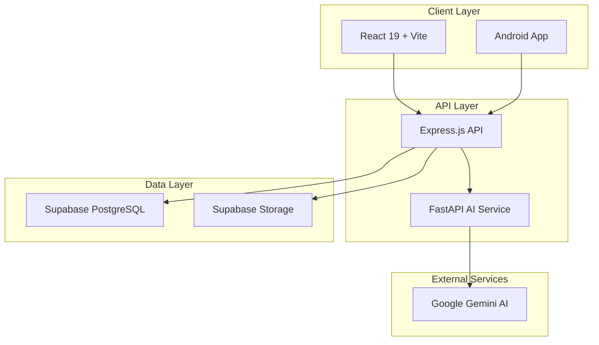

# 📚 Literati Documentation

Welcome to the comprehensive documentation for the Literati Digital Library. This documentation covers everything from development setup to production deployment and maintenance.

## 📋 **Documentation Overview**

| Document | Purpose | Audience |
|----------|---------|----------|
| **[Environment Setup](./ENVIRONMENT_SETUP.md)** | Complete setup guide for all services | Developers, DevOps |
| **[API Documentation](./API.md)** | Complete REST API reference | Developers, Integrators |
| **[Deployment Guide](./DEPLOYMENT.md)** | Production deployment procedures | DevOps, Developers |
| **[Developer Onboarding](./DEVELOPER_ONBOARDING.md)** | New developer guide and team processes | New Team Members |
| **[Troubleshooting](./TROUBLESHOOTING.md)** | Issue resolution and maintenance | DevOps, Support Team |

## 🎯 **Quick Start Paths**

### **👨‍💻 New Developer?**
1. **[Developer Onboarding](./DEVELOPER_ONBOARDING.md)** - Start here for complete team onboarding
2. **[Environment Setup](./ENVIRONMENT_SETUP.md)** - Set up your development environment
3. **[API Documentation](./API.md)** - Learn the API structure and endpoints

### **🚀 Ready to Deploy?**
1. **[Deployment Guide](./DEPLOYMENT.md)** - Complete deployment procedures
2. **[Troubleshooting](./TROUBLESHOOTING.md)** - Maintenance and issue resolution
3. **[Security Documentation](../server2/SECURITY_DOCUMENTATION.md)** - Security implementation details

### **🔍 Need Help?**
1. **[Troubleshooting](./TROUBLESHOOTING.md)** - Common issues and solutions
2. **[API Documentation](./API.md)** - API endpoint details and examples
3. **GitHub Issues** - Create an issue for bugs or feature requests

## 🏗️ **Architecture Quick Reference**



## 📖 **Documentation Standards**

### **For Developers Adding Documentation**
- ✅ **Clear headings** with emoji for easy scanning
- ✅ **Code examples** with syntax highlighting
- ✅ **Step-by-step procedures** with numbered lists
- ✅ **Error handling** and troubleshooting sections
- ✅ **Prerequisites** clearly listed
- ✅ **Links** between related documents

### **Document Structure**
```markdown
# Title with Emoji

Brief description of the document's purpose.

## Prerequisites/Overview
What you need before starting.

## Main Content
Step-by-step instructions with examples.

## Troubleshooting
Common issues and solutions.

## Next Steps/Related Links
Where to go next.
```

## 🔧 **Development Standards**

### **Code Quality**
- ✅ **ESLint**: No linting errors
- ✅ **Prettier**: Consistent formatting
- ✅ **Tests**: >80% coverage for new features
- ✅ **Security**: Follow security documentation guidelines
- ✅ **Documentation**: Update docs when changing APIs

### **Git Workflow**
```bash
main                # Production branch
├── develop        # Development branch
├── feature/*      # Feature branches
├── hotfix/*       # Emergency fixes
└── release/*      # Release preparation
```

### **Commit Standards**
```bash
feat: add book search functionality
fix: resolve authentication token expiration
docs: update API documentation for notes endpoint
refactor: optimize database query performance
test: add unit tests for book management
security: update vulnerable dependencies
```

## 📊 **Project Status**

### **✅ Production Ready Features**
- **Authentication**: JWT with refresh token rotation
- **Security**: Enterprise-grade (rate limiting, input validation, headers)
- **API**: RESTful with comprehensive documentation
- **Database**: Optimized PostgreSQL with RLS
- **AI Integration**: Google Gemini for note summarization
- **CI/CD**: Automated testing and deployment
- **PWA**: Offline support and service workers
- **Monitoring**: Health checks and error tracking

### **🏗️ Architecture Highlights**
- **Monorepo**: Unified codebase with pnpm workspaces
- **Multi-service**: Frontend, Backend API, AI Service, Mobile
- **Cloud-native**: Vercel, Render, Supabase deployment
- **Security-first**: 7-layer security stack
- **Performance-optimized**: Caching, query optimization, lazy loading

## 🚀 **Getting Started**

### **For New Team Members**
1. Read **[Developer Onboarding](./DEVELOPER_ONBOARDING.md)**
2. Complete environment setup
3. Make your first contribution
4. Join code reviews and team discussions

### **For DevOps/Infrastructure**
1. Review **[Deployment Guide](./DEPLOYMENT.md)**
2. Set up monitoring and alerts
3. Configure production secrets
4. Test disaster recovery procedures

### **For API Consumers**
1. Study **[API Documentation](./API.md)**
2. Get authentication working
3. Implement core endpoints
4. Add error handling and rate limiting

## 📞 **Support and Contributing**

### **Getting Help**
1. **Check documentation** first (you're here! 👍)
2. **Search existing issues** on GitHub
3. **Ask team members** via your preferred communication channel
4. **Create detailed issue** with reproduction steps

### **Contributing**
1. **Fork the repository** and create feature branch
2. **Make changes** following code standards
3. **Add/update tests** and documentation
4. **Submit pull request** with clear description

### **Reporting Issues**
When creating issues, include:
- **Clear description** of the problem
- **Steps to reproduce** the issue
- **Expected vs actual** behavior
- **Environment details** (OS, browser, Node version)
- **Screenshots** or error messages

## 🎯 **Roadmap & Future Enhancements**

### **Next Major Features**
- Enhanced mobile app with offline sync
- Advanced AI features (book recommendations, reading analytics)
- Social features (reading groups, book sharing)
- Multi-language support
- Enhanced accessibility features

### **Technical Improvements**
- Microservices architecture migration
- Advanced caching strategies
- Real-time collaboration features
- Enhanced security monitoring
- Performance optimizations

## 📈 **Metrics and KPIs**

### **Technical Metrics**
- **Uptime**: >99.9% target
- **Response Time**: <500ms p95 for API calls
- **Error Rate**: <1% for all endpoints
- **Security**: Zero critical vulnerabilities
- **Test Coverage**: >80% for all services

### **User Experience Metrics**
- **Page Load Time**: <3s for Core Web Vitals
- **Mobile Performance**: >90 Lighthouse score
- **Accessibility**: WCAG 2.1 AA compliance
- **PWA Features**: Offline functionality, install prompts

## 🔒 **Security Overview**

Your Literati application implements **enterprise-grade security**:

- 🛡️ **4-tier rate limiting** (General/Auth/Upload/Gaming)
- 🔐 **Advanced JWT security** with token families
- 🧹 **Multi-layer input sanitization** and validation
- 🛡️ **Comprehensive security headers** with CSP
- 📊 **Automated security scanning** (daily + on-demand)
- 🔍 **Security monitoring** with threat detection

For complete security details, see **[Security Documentation](../server2/SECURITY_DOCUMENTATION.md)**.

---

## 📚 **Document Index**

### **Primary Documentation**
- **[Environment Setup Guide](./ENVIRONMENT_SETUP.md)** - Complete development environment setup
- **[API Documentation](./API.md)** - REST API reference and examples
- **[Deployment Guide](./DEPLOYMENT.md)** - Production deployment procedures
- **[Developer Onboarding](./DEVELOPER_ONBOARDING.md)** - New team member guide
- **[Troubleshooting Guide](./TROUBLESHOOTING.md)** - Issue resolution and maintenance

### **Specialized Documentation**
- **[Security Documentation](../server2/SECURITY_DOCUMENTATION.md)** - Security implementation details
- **[Production Readiness Review](../Literati-Production_Readiness_Review.md)** - Production assessment
- **[CI/CD Setup Guide](../DEPLOYMENT_AUTOMATION_SETUP.md)** - Automated deployment setup

### **Project Files**
- **[Root README](../README.md)** - Project overview and quick start
- **[CLAUDE.md](../CLAUDE.md)** - Development guidelines for AI assistance

---

**Welcome to Literati! Happy reading and coding! 📚🚀**

*Last updated: December 2024*
*Documentation version: 1.0.0*